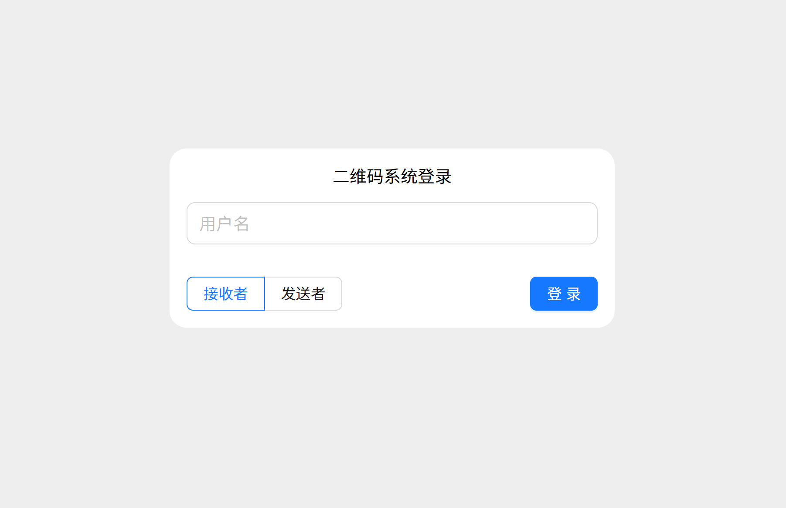
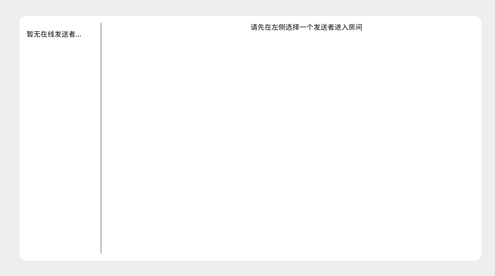
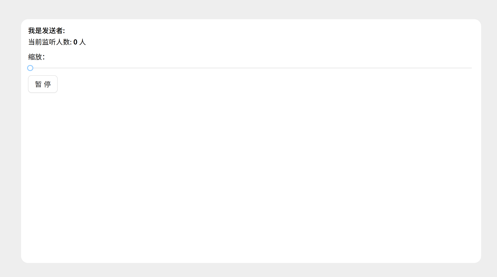

# 二维码分享器

你是否在头疼雨课堂动态二维码签到？此项目旨在帮助用户快速生成并分享二维码图片，一人扫码，全宿舍签到。
前端：Vue + Ant Design Vue + Socket.IO
后端：Node

# 搭建

由于浏览器的限制，必须是HTTPS服务器才能调用用户摄像头，所以需要为项目配置SSL证书。建议为这个项目生成临时私钥和创建临时SSL证书。新建目录：apps/server/secrets，将证书server.crt和私钥server.key放入该目录。（文件名不要改）

创建临时密钥和证书可参考：https://developer.baidu.com/article/detail.html?id=4069579

测试项目：`pnpm dev`
构建项目：`pnpm build`
启动服务器：`pnpm start`

# 使用

1. 选择角色（二维码发送者/接收者），输入用户名使用，没有鉴权机制，用户名只是为了区分不同用户。
2. 发送者每次扫码后，二维码会自动发送给接收者，接收者会实时收到最新的二维码。
3. 接收者会看到一个发送者列表，选择要监听的发送者，进入它的房间，等待发送者发送二维码。
4. 一人部署，可多人使用。

> 并不会传输二维码图片，而是传输二维码解码后的URL，接收者通过URL重新生成二维码图片，原因显然

# 页面预览

